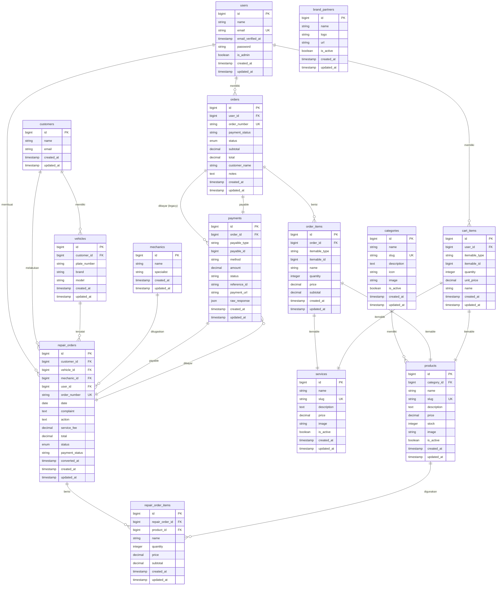
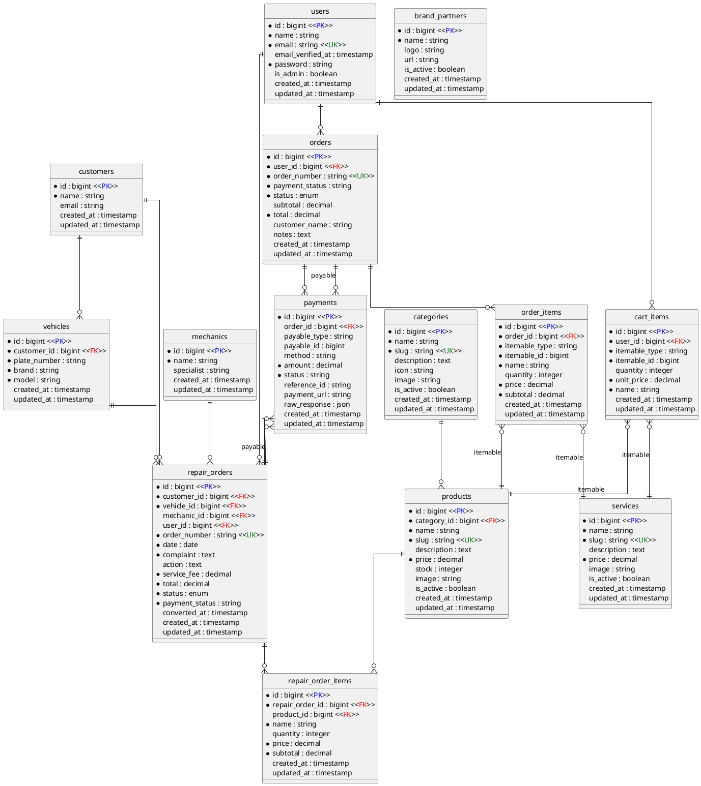

# Entity Relationship Diagram (ERD) — BVS Bengkel Untirta

**Aplikasi:** BVS Bengkel Untirta (Sistem Informasi Bengkel)  
**Database:** MySQL  
**Tech:** Laravel 13, Eloquent ORM

---

## Daftar Tabel Bisnis (14 tabel)

| No | Tabel | Keterangan |
|----|-------|------------|
| 1 | `users` | Pengguna sistem (admin / customer) |
| 2 | `customers` | Data pelanggan bengkel |
| 3 | `vehicles` | Data kendaraan pelanggan |
| 4 | `mechanics` | Data mekanik bengkel |
| 5 | `categories` | Kategori produk / sparepart |
| 6 | `products` | Data produk / sparepart |
| 7 | `services` | Daftar jasa servis bengkel |
| 8 | `brand_partners` | Mitra brand (display halaman publik) |
| 9 | `orders` | Transaksi penjualan produk |
| 10 | `order_items` | Item dalam transaksi penjualan (polymorphic: produk / jasa) |
| 11 | `repair_orders` | Transaksi servis kendaraan |
| 12 | `repair_order_items` | Sparepart yang digunakan dalam servis |
| 13 | `payments` | Riwayat pembayaran (polymorphic: order / repair_order) |
| 14 | `cart_items` | Keranjang belanja sementara |

> **Catatan:** Tabel bawaan Laravel (`password_reset_tokens`, `sessions`, `cache`, `cache_locks`, `personal_access_tokens`) tidak dimasukkan karena tidak terkait langsung dengan proses bisnis.

---

## Mermaid ER Diagram

---

## PlantUML ER Diagram

---

## Skema Relasi Database

| Tabel | Primary Key | Foreign Key | Berelasi Dengan | Jenis Relasi |
|-------|-------------|-------------|-----------------|--------------|
| `users` | `id` | — | — | — |
| `customers` | `id` | — | — | — |
| `mechanics` | `id` | — | — | — |
| `categories` | `id` | — | — | — |
| `products` | `id` | — | — | — |
| `services` | `id` | — | — | — |
| `brand_partners` | `id` | — | — | — |
| `vehicles` | `id` | `customer_id` | `customers.id` | Many-to-One |
| `orders` | `id` | `user_id` | `users.id` | Many-to-One |
| `order_items` | `id` | `order_id` | `orders.id` | Many-to-One |
| `order_items` | — | `itemable_id` + `itemable_type` | `products.id` atau `services.id` | Polymorphic Many-to-One |
| `repair_orders` | `id` | `customer_id` | `customers.id` | Many-to-One |
| `repair_orders` | `id` | `vehicle_id` | `vehicles.id` | Many-to-One |
| `repair_orders` | `id` | `mechanic_id` | `mechanics.id` | Many-to-One (nullable) |
| `repair_orders` | `id` | `user_id` | `users.id` | Many-to-One (nullable) |
| `repair_order_items` | `id` | `repair_order_id` | `repair_orders.id` | Many-to-One |
| `repair_order_items` | `id` | `product_id` | `products.id` | Many-to-One (nullable) |
| `payments` | `id` | `order_id` | `orders.id` | Many-to-One (nullable, legacy) |
| `payments` | — | `payable_id` + `payable_type` | `orders.id` atau `repair_orders.id` | Polymorphic Many-to-One |
| `cart_items` | `id` | `user_id` | `users.id` | Many-to-One |
| `cart_items` | — | `itemable_id` + `itemable_type` | `products.id` atau `services.id` | Polymorphic Many-to-One |

---

## Kamus Data (Data Dictionary)

### 1. Tabel `users` — Pengguna Sistem

| Kolom | Tipe | Keterangan |
|-------|------|------------|
| `id` | bigint (PK) | Primary key |
| `name` | string(191) | Nama lengkap pengguna |
| `email` | string(191) | Alamat email (unique) |
| `email_verified_at` | timestamp | Tanggal verifikasi email (nullable) |
| `password` | string(191) | Hash password (bcrypt) |
| `is_admin` | boolean | Flag admin (default false) |
| `remember_token` | string(100) | Token "remember me" (nullable) |
| `created_at` | timestamp | Waktu dibuat |
| `updated_at` | timestamp | Waktu diupdate |

### 2. Tabel `customers` — Data Pelanggan

| Kolom | Tipe | Keterangan |
|-------|------|------------|
| `id` | bigint (PK) | Primary key |
| `name` | string(191) | Nama pelanggan |
| `email` | string(191) | Alamat email (nullable) |
| `created_at` | timestamp | Waktu dibuat |
| `updated_at` | timestamp | Waktu diupdate |

### 3. Tabel `vehicles` — Data Kendaraan

| Kolom | Tipe | Keterangan |
|-------|------|------------|
| `id` | bigint (PK) | Primary key |
| `customer_id` | bigint (FK) | ID pelanggan pemilik |
| `plate_number` | string(191) | Nomor polisi |
| `brand` | string(191) | Merk kendaraan |
| `model` | string(191) | Tipe/model kendaraan |
| `created_at` | timestamp | Waktu dibuat |
| `updated_at` | timestamp | Waktu diupdate |

### 4. Tabel `mechanics` — Data Mekanik

| Kolom | Tipe | Keterangan |
|-------|------|------------|
| `id` | bigint (PK) | Primary key |
| `name` | string(191) | Nama mekanik |
| `specialist` | string(191) | Spesialisasi (nullable) |
| `created_at` | timestamp | Waktu dibuat |
| `updated_at` | timestamp | Waktu diupdate |

### 5. Tabel `categories` — Kategori Produk

| Kolom | Tipe | Keterangan |
|-------|------|------------|
| `id` | bigint (PK) | Primary key |
| `name` | string(191) | Nama kategori |
| `slug` | string(191) | Slug URL (unique) |
| `description` | text | Deskripsi kategori (nullable) |
| `icon` | string(191) | Nama icon (nullable) |
| `image` | string(191) | Path gambar (nullable) |
| `is_active` | boolean | Status aktif (default true) |
| `created_at` | timestamp | Waktu dibuat |
| `updated_at` | timestamp | Waktu diupdate |

### 6. Tabel `products` — Data Produk / Sparepart

| Kolom | Tipe | Keterangan |
|-------|------|------------|
| `id` | bigint (PK) | Primary key |
| `category_id` | bigint (FK) | ID kategori |
| `name` | string(191) | Nama produk |
| `slug` | string(191) | Slug URL (unique) |
| `description` | text | Deskripsi produk (nullable) |
| `price` | decimal(12,2) | Harga jual |
| `stock` | integer | Jumlah stok (default 0) |
| `image` | string(191) | Path gambar (nullable) |
| `is_active` | boolean | Status aktif (default true) |
| `created_at` | timestamp | Waktu dibuat |
| `updated_at` | timestamp | Waktu diupdate |

### 7. Tabel `services` — Daftar Jasa Servis

| Kolom | Tipe | Keterangan |
|-------|------|------------|
| `id` | bigint (PK) | Primary key |
| `name` | string(191) | Nama jasa servis |
| `slug` | string(191) | Slug URL (unique) |
| `description` | text | Deskripsi (nullable) |
| `price` | decimal(12,2) | Biaya jasa |
| `image` | string(191) | Path gambar (nullable) |
| `is_active` | boolean | Status aktif (default true) |
| `created_at` | timestamp | Waktu dibuat |
| `updated_at` | timestamp | Waktu diupdate |

### 8. Tabel `brand_partners` — Mitra Brand

| Kolom | Tipe | Keterangan |
|-------|------|------------|
| `id` | bigint (PK) | Primary key |
| `name` | string(191) | Nama brand |
| `logo` | string(191) | Path logo (nullable) |
| `url` | string(191) | URL website (nullable) |
| `is_active` | boolean | Status aktif (default true) |
| `created_at` | timestamp | Waktu dibuat |
| `updated_at` | timestamp | Waktu diupdate |

### 9. Tabel `orders` — Transaksi Penjualan Produk

| Kolom | Tipe | Keterangan |
|-------|------|------------|
| `id` | bigint (PK) | Primary key |
| `user_id` | bigint (FK) | ID pembeli (users) |
| `order_number` | string(191) | Nomor invoice (unique) |
| `status` | enum | Status: pending, processing, completed, cancelled |
| `payment_status` | string(191) | Status bayar: pending, paid, failed |
| `subtotal` | decimal(12,2) | Subtotal item (default 0) |
| `total` | decimal(12,2) | Total pembayaran (default 0) |
| `customer_name` | string(191) | Nama pelanggan (nullable) |
| `notes` | text | Catatan tambahan (nullable) |
| `created_at` | timestamp | Waktu dibuat |
| `updated_at` | timestamp | Waktu diupdate |

### 10. Tabel `order_items` — Item Transaksi Penjualan

| Kolom | Tipe | Keterangan |
|-------|------|------------|
| `id` | bigint (PK) | Primary key |
| `order_id` | bigint (FK) | ID transaksi |
| `itemable_type` | string(191) | Tipe item (App\\Models\\Product / App\\Models\\Service) |
| `itemable_id` | bigint | ID item terkait |
| `name` | string(191) | Nama item (snapshot) |
| `quantity` | integer | Jumlah (default 1) |
| `price` | decimal(12,2) | Harga per unit |
| `subtotal` | decimal(12,2) | Subtotal |
| `created_at` | timestamp | Waktu dibuat |
| `updated_at` | timestamp | Waktu diupdate |

### 11. Tabel `repair_orders` — Transaksi Servis

| Kolom | Tipe | Keterangan |
|-------|------|------------|
| `id` | bigint (PK) | Primary key |
| `customer_id` | bigint (FK) | ID pelanggan |
| `vehicle_id` | bigint (FK) | ID kendaraan |
| `mechanic_id` | bigint (FK) | ID mekanik (nullable) |
| `user_id` | bigint (FK) | ID pembuat (nullable) |
| `order_number` | string(191) | Nomor invoice servis (unique) |
| `date` | date | Tanggal servis |
| `complaint` | text | Keluhan pelanggan |
| `action` | text | Tindakan mekanik (nullable) |
| `service_fee` | decimal(12,2) | Biaya jasa (default 0) |
| `total` | decimal(12,2) | Total pembayaran (default 0) |
| `status` | enum | Status: menunggu, proses, selesai, dibatalkan |
| `payment_status` | string(191) | Status bayar: pending, paid, failed |
| `converted_at` | timestamp | Waktu konversi sparepart ke transaksi penjualan (nullable) |
| `created_at` | timestamp | Waktu dibuat |
| `updated_at` | timestamp | Waktu diupdate |

### 12. Tabel `repair_order_items` — Sparepart Servis

| Kolom | Tipe | Keterangan |
|-------|------|------------|
| `id` | bigint (PK) | Primary key |
| `repair_order_id` | bigint (FK) | ID transaksi servis |
| `product_id` | bigint (FK) | ID produk (nullable) |
| `name` | string(191) | Nama sparepart (snapshot) |
| `quantity` | integer | Jumlah (default 1) |
| `price` | decimal(12,2) | Harga per unit |
| `subtotal` | decimal(12,2) | Subtotal |
| `created_at` | timestamp | Waktu dibuat |
| `updated_at` | timestamp | Waktu diupdate |

### 13. Tabel `payments` — Riwayat Pembayaran

| Kolom | Tipe | Keterangan |
|-------|------|------------|
| `id` | bigint (PK) | Primary key |
| `order_id` | bigint (FK) | ID order produk (nullable, legacy) |
| `payable_type` | string(191) | Tipe entitas yang dibayar (nullable) |
| `payable_id` | bigint | ID entitas yang dibayar (nullable) |
| `method` | string(191) | Metode pembayaran (nullable) |
| `amount` | decimal(12,2) | Jumlah pembayaran |
| `status` | string(191) | Status: pending, berhasil, gagal, cancelled |
| `reference_id` | string(191) | ID referensi dari payment gateway (nullable) |
| `payment_url` | string(191) | URL redirect payment gateway (nullable) |
| `raw_response` | json | Raw response dari payment gateway (nullable) |
| `created_at` | timestamp | Waktu dibuat |
| `updated_at` | timestamp | Waktu diupdate |

### 14. Tabel `cart_items` — Keranjang Belanja

| Kolom | Tipe | Keterangan |
|-------|------|------------|
| `id` | bigint (PK) | Primary key |
| `user_id` | bigint (FK) | ID pengguna |
| `itemable_type` | string(191) | Tipe item (App\\Models\\Product / App\\Models\\Service) |
| `itemable_id` | bigint | ID item |
| `quantity` | integer | Jumlah (default 1) |
| `unit_price` | decimal(12,2) | Harga per unit |
| `name` | string(191) | Nama item (snapshot) |
| `created_at` | timestamp | Waktu dibuat |
| `updated_at` | timestamp | Waktu diupdate |

---

## Penjelasan Relasi (Bahasa Indonesia Formal)

### 1. User → Orders (One-to-Many)
Satu pengguna (`users`) dapat melakukan banyak transaksi penjualan (`orders`), sedangkan satu transaksi penjualan hanya dimiliki oleh satu pengguna. Relasi ini diimplementasikan melalui foreign key `orders.user_id` yang merujuk ke `users.id` dengan **ON DELETE CASCADE**.

### 2. User → Repair Orders (One-to-Many)
Satu pengguna (`users`) dapat membuat banyak transaksi servis (`repair_orders`), sedangkan satu transaksi servis dapat dibuat oleh satu pengguna. Foreign key `repair_orders.user_id` bersifat nullable (opsional) dengan **ON DELETE SET NULL**.

### 3. User → Cart Items (One-to-Many)
Satu pengguna (`users`) dapat memiliki banyak item di keranjang belanja (`cart_items`), sedangkan satu item keranjang hanya dimiliki oleh satu pengguna. Foreign key `cart_items.user_id` menggunakan **ON DELETE CASCADE**.

### 4. Customer → Vehicles (One-to-Many)
Satu pelanggan (`customers`) dapat memiliki banyak kendaraan (`vehicles`), sedangkan satu kendaraan hanya dimiliki oleh satu pelanggan. Foreign key `vehicles.customer_id` menggunakan **ON DELETE CASCADE**.

### 5. Customer → Repair Orders (One-to-Many)
Satu pelanggan (`customers`) dapat melakukan banyak transaksi servis (`repair_orders`), sedangkan satu transaksi servis hanya dimiliki oleh satu pelanggan. Foreign key `repair_orders.customer_id` menggunakan **ON DELETE CASCADE**.

### 6. Vehicle → Repair Orders (One-to-Many)
Satu kendaraan (`vehicles`) dapat memiliki banyak riwayat servis (`repair_orders`), sedangkan satu transaksi servis hanya melibatkan satu kendaraan. Foreign key `repair_orders.vehicle_id` menggunakan **ON DELETE CASCADE**.

### 7. Mechanic → Repair Orders (One-to-Many)
Satu mekanik (`mechanics`) dapat ditugaskan ke banyak transaksi servis (`repair_orders`), sedangkan satu transaksi servis dapat ditangani oleh satu mekanik. Foreign key `repair_orders.mechanic_id` bersifat nullable dengan **ON DELETE SET NULL**.

### 8. Category → Products (One-to-Many)
Satu kategori (`categories`) dapat memiliki banyak produk (`products`), sedangkan satu produk hanya berada dalam satu kategori. Foreign key `products.category_id` menggunakan **ON DELETE CASCADE**.

### 9. Order → Order Items (One-to-Many)
Satu transaksi penjualan (`orders`) dapat memiliki banyak item (`order_items`), sedangkan satu item hanya dimiliki oleh satu transaksi. Foreign key `order_items.order_id` menggunakan **ON DELETE CASCADE**.

### 10. Order Items → Product / Service (Polymorphic Many-to-One)
Setiap item dalam transaksi penjualan (`order_items`) dapat merujuk ke produk (`products`) atau jasa (`services`) melalui mekanisme **polymorphic**. Kolom `itemable_type` menyimpan nama kelas model target (contoh: `App\Models\Product`), sedangkan `itemable_id` menyimpan ID-nya. Tidak ada foreign key di level database karena relasi ini bersifat dinamis.

### 11. Repair Order → Repair Order Items (One-to-Many)
Satu transaksi servis (`repair_orders`) dapat memiliki banyak sparepart (`repair_order_items`), sedangkan satu item sparepart hanya dimiliki oleh satu transaksi servis. Foreign key `repair_order_items.repair_order_id` menggunakan **ON DELETE CASCADE**.

### 12. Repair Order Items → Product (Many-to-One)
Setiap sparepart yang digunakan dalam servis (`repair_order_items`) dapat merujuk ke satu produk (`products`). Relasi ini bersifat opsional (nullable) dengan **ON DELETE SET NULL**, karena sparepart dapat dicatat manual tanpa harus ada di database inventory.

### 13. Order / Repair Order → Payment (Polymorphic One-to-Many)
Baik transaksi penjualan (`orders`) maupun transaksi servis (`repair_orders`) dapat memiliki banyak riwayat pembayaran (`payments`) melalui mekanisme **polymorphic**. Kolom `payable_type` dan `payable_id` menentukan entitas mana yang dibayar. Pendekatan ini memungkinkan satu tabel `payments` melayani dua jenis transaksi berbeda.

Selain relasi polymorphic, tabel `payments` juga memiliki foreign key `order_id` langsung ke `orders.id` (legacy) yang bersifat nullable. Relasi ini tetap dipertahankan untuk kompatibilitas dengan data transaksi penjualan yang sudah ada sebelumnya.

### 14. Cart Items → Product / Service (Polymorphic Many-to-One)
Item di keranjang belanja (`cart_items`) dapat merujuk ke produk (`products`) atau jasa (`services`) melalui mekanisme polymorphic, sama seperti `order_items`. Kolom `itemable_type` dan `itemable_id` menentukan item yang dimaksud.

---

## Foreign Key Constraints

| No | Kolom Referensi | Tabel Referensi | Kolom Referensi | ON DELETE | Nullable |
|----|-----------------|-----------------|-----------------|-----------|----------|
| 1 | `products.category_id` | `categories` | `id` | CASCADE | Tidak |
| 2 | `orders.user_id` | `users` | `id` | CASCADE | Tidak |
| 3 | `order_items.order_id` | `orders` | `id` | CASCADE | Tidak |
| 4 | `payments.order_id` | `orders` | `id` | CASCADE | Ya |
| 5 | `cart_items.user_id` | `users` | `id` | CASCADE | Tidak |
| 6 | `vehicles.customer_id` | `customers` | `id` | CASCADE | Tidak |
| 7 | `repair_orders.customer_id` | `customers` | `id` | CASCADE | Tidak |
| 8 | `repair_orders.vehicle_id` | `vehicles` | `id` | CASCADE | Tidak |
| 9 | `repair_orders.mechanic_id` | `mechanics` | `id` | SET NULL | Ya |
| 10 | `repair_orders.user_id` | `users` | `id` | SET NULL | Ya |
| 11 | `repair_order_items.repair_order_id` | `repair_orders` | `id` | CASCADE | Tidak |
| 12 | `repair_order_items.product_id` | `products` | `id` | SET NULL | Ya |

---

## Evaluasi terhadap Kebutuhan Tugas Akhir

| Kebutuhan | Status | Keterangan |
|-----------|--------|------------|
| Sistem Informasi Bengkel | ✅ Terpenuhi | Mencakup manajemen pelanggan, kendaraan, mekanik, sparepart, servis, dan penjualan |
| Entitas Admin / Mekanik | ✅ Terpenuhi | Tabel `users` (dengan role admin) dan `mechanics` |
| Entitas Pelanggan | ✅ Terpenuhi | Tabel `customers` dan `users` (customer terdaftar) |
| Entitas Kendaraan | ✅ Terpenuhi | Tabel `vehicles` dengan relasi ke pelanggan |
| Transaksi Servis | ✅ Terpenuhi | Tabel `repair_orders` + `repair_order_items` |
| Transaksi Penjualan | ✅ Terpenuhi | Tabel `orders` + `order_items` |
| Authentication | ✅ Terpenuhi | Tabel `users` dengan Laravel Breeze + Sanctum |
| REST API | ✅ Terpenuhi | Sanctum token auth, endpoint `/api/services` dan `/api/customers` |
| Payment | ✅ Terpenuhi | Tabel `payments` dengan polymorphic relasi ke order / servis |

---

*Dokumen ini dibuat berdasarkan analisis source code Laravel — migration, model, Eloquent relationships, foreign key constraints, dan kondisi database terbaru.*  
*Kolom yang sudah dihapus (`vehicles.year`, `vehicles.color`, `customers.phone`, `customers.address`, `mechanics.phone`) tidak dimasukkan.*  
*Generated: Juli 2026*
